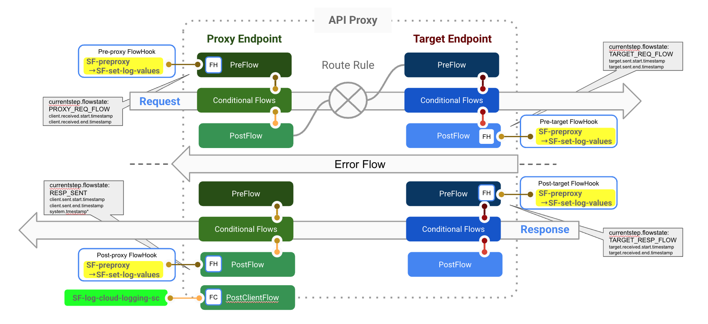

# Apigee X Logging to Cloud Logging
Shared Flow and API Proxy design for API traffic logging to GCP Cloud Logging.

**Best Practice:** Capture logging information and log once in Post Client Flow.

Captures logging information via JavaScript at each of the Flow Hook locations and builds a "logging-message" that is sent to Cloud Logging in the API Proxy Post Client Flow using a Shared Flow with a Service Callout in fire-n-forget mode.

### Flow Diagram


## Overview
### Shared Flows
* **log-set-values-v1** (Shared Flow in each of the Flow Hook Shared Flows)
* **log-cloud-logging-sc-v1** (Flow Callout in API Proxy Post Client Flow using Service Callout)
* **pre-proxy-v1** (Flow Callout to log-set-values-v1)
* **pre-target-v1** (Flow Callout to log-set-values-v1)
* **post-target-v1** (Flow Callout to log-set-values-v1)
* **post-proxy-v1** (Flow Callout to log-set-values-v1)

Each of the Flow Callouts in the Flow Hook Shared Flows passes a parameter which is used to detect the flow location.
```
<FlowCallout name="FC-log-set-values-v1">
  <Parameters>
    <!-- Need to pass currentstep.flowstate, its empty otherwise -->
    <Parameter name="currentstep.flowstate">{currentstep.flowstate}</Parameter>
  </Parameters>
  <SharedFlowBundle>log-set-values-v1</SharedFlowBundle>
</FlowCallout>
```

## Tests
```
curl "https://$HOST/logging-demo-v1/status"
curl -X POST "https://$HOST/logging-demo-v1/status" -d '{"hello":"Apigeek"}'
curl "https://$HOST/logging-demo-v1/status-xml" # returns non-json response
curl "https://$HOST/logging-demo-v1/status?bad=true"  # forced error
curl "https://$HOST/logging-demo-v1/status?error=true"```
```

### Test /status
```
curl -s https://xapi-test.kurtkanaskie.net/logging-demo-v1/status | jq

{
  "logging_level": "DEBUG",
  "region": "us-east1",
  "oas_request_flow": "",
  "total_latency": "385.0",
  "DC_latency": "",
  "ssn": "123-456-7890",
  "ccn": "123-456-7890",
  "phone": "866-555-1212",
  "accountNumber": 1234567890,
  "request.path": "/logging-demo-v1/status",
  "response.status.code": "200",
  "backend_message": [
    {
      "headers": {
        "host": "mocktarget.apigee.net",
        "x-cloud-trace-context": "9840e0bf1b0338e12b0442da75309b59/16876304811991103721",
        "via": "1.1 google",
        "x-forwarded-for": "34.148.217.215, 35.227.194.212",
        "x-forwarded-proto": "https",
        "connection": "Keep-Alive"
      },
      "method": "GET",
      "url": "/",
      "args": {},
      "body": ""
    }
  ]
}

```

Resulting "logging-message"
```
{
	"logLevel": "DEBUG",
	"messageId": "b5c4d64b-c6af-4355-95ea-289ac347264410",
	"messageProcessorId": "154818ae-158a-4cc1-867a-a6d6704d2efd",
	"logging_request_trace_context": "1273f98b428bf6443c338612d2fa3fb7/2345038408690694647",
	"organization": "apigeex-mint-kurt",
	"environment": "test",
	"region": "us-east1",
	"appName": null,
	"apiProduct": null,
	"proxyName": "logging-demo-v1",
	"receivedTimestamp": 1691444480539,
	"sentTimestamp": 1691444480986,
	"receivedTimestampISO": "2023-08-07T21:41:20.539Z",
	"sentTimestampISO": "2023-08-07T21:41:20.986Z",
	"clientLatency": 304,
	"targetLatency": 143,
	"totalLatency": 447,
	"proxyRequest": {
		"method": "GET",
		"url": "https://xapi-test.kurtkanaskie.net/logging-demo-v1/status",
		"oasRequestFlow": null,
		"headers": {
			"accept": "*/*",
			"host": "xapi-test.kurtkanaskie.net",
			"user-agent": "curl/8.1.2",
			"via": "1.1 google",
			"x-b3-sampled": "0",
			"x-b3-spanid": "47512d481b382a75",
			"x-b3-traceid": "13bd4e62785a627f47512d481b382a75",
			"x-cloud-trace-context": "1273f98b428bf6443c338612d2fa3fb7/2345038408690694647",
			"x-envoy-attempt-count": "1",
			"x-forwarded-for": "131.106.40.233, 34.149.167.159,10.42.0.6",
			"x-forwarded-proto": "https",
			"x-request-client-city": "Allentown",
			"x-request-client-city-lat-long": "40.602294,-75.471410",
			"x-request-client-ip-address": "131.106.40.233",
			"x-request-client-region": "US",
			"x-request-client-region-subdivision": "USPA",
			"x-request-glb-tls-cipher-suite": "1302",
			"x-request-glb-tls-version": "TLSv1.3",
			"x-request-id": "94212c85-93ca-45cf-b8e3-baa6ccce484c"
		}
	},
	"targetRequest": {
		"method": "GET",
		"url": "https://mocktarget.apigee.net/echo",
		"headers": {}
	},
	"targetResponse": {
		"status": 200,
		"reason": "OK",
		"headers": {
			"Access-Control-Allow-Origin": "*",
			"Alt-Svc": "h3=\":443\"; ma=2592000,h3-29=\":443\"; ma=2592000",
			"Content-Length": "293",
			"Content-Type": "application/json; charset=utf-8",
			"Date": "Mon, 07 Aug 2023 21:41:20 GMT",
			"ETag": "W/\"125-jvEmnyWCfAAFf9AKPfmFK6UMPZ4\"",
			"Via": "1.1 google",
			"X-Content-Type-Options": "nosniff",
			"X-Frame-Options": "ALLOW-FROM RESOURCE-URL",
			"X-Powered-By": "Apigee",
			"X-XSS-Protection": "1"
		},
		"content": {
			"headers": {
				"host": "mocktarget.apigee.net",
				"x-cloud-trace-context": "41f00b911172ba2b956e39e09dbddf25/11083787769868367050",
				"via": "1.1 google",
				"x-forwarded-for": "34.148.217.215, 35.227.194.212",
				"x-forwarded-proto": "https",
				"connection": "Keep-Alive"
			},
			"method": "GET",
			"url": "/",
			"args": {},
			"body": ""
		}
	},
	"proxyResponse": {
		"status": 200,
		"reason": "OK",
		"headers": {
			"Access-Control-Allow-Origin": "*",
			"Alt-Svc": "h3=\":443\"; ma=2592000,h3-29=\":443\"; ma=2592000",
			"Content-Length": "293",
			"Content-Type": "application/json",
			"Date": "Mon, 07 Aug 2023 21:41:20 GMT",
			"ETag": "W/\"125-jvEmnyWCfAAFf9AKPfmFK6UMPZ4\"",
			"Via": "1.1 google",
			"X-Content-Type-Options": "nosniff",
			"X-Frame-Options": "ALLOW-FROM RESOURCE-URL",
			"X-Powered-By": "Apigee",
			"X-XSS-Protection": "1"
		},
		"content": {
			"logging_level": "DEBUG",
			"region": "us-east1",
			"oas_request_flow": "",
			"total_latency": "427.0",
			"DC_latency": "",
			"ssn": "XXXXXXXXXXXX",
			"ccn": "XXXXXXXXXXXX",
			"phone": "866-555-1212",
			"accountNumber": 9999999999,
			"request.path": "/logging-demo-v1/status",
			"response.status.code": "200",
			"backend_message": [{
				"headers": {
					"host": "mocktarget.apigee.net",
					"x-cloud-trace-context": "41f00b911172ba2b956e39e09dbddf25/11083787769868367050",
					"via": "1.1 google",
					"x-forwarded-for": "34.148.217.215, 35.227.194.212",
					"x-forwarded-proto": "https",
					"connection": "Keep-Alive"
				},
				"method": "GET",
				"url": "/",
				"args": {},
				"body": ""
			}]
		}
	}
}
```

## Disclaimer

This example is not an official Google product, nor is it part of an official Google product.

## Notice and License

[NOTICE](NOTICE) this material is copyright 2020, Google LLC. and [LICENSE](LICENSE) is under the Apache 2.0 license. This code is open source.

## TBD
- add proxy README
- Show KVM configuration and updates - in InitialValues in KV-log-config policy
- Automate with CI/CD.
